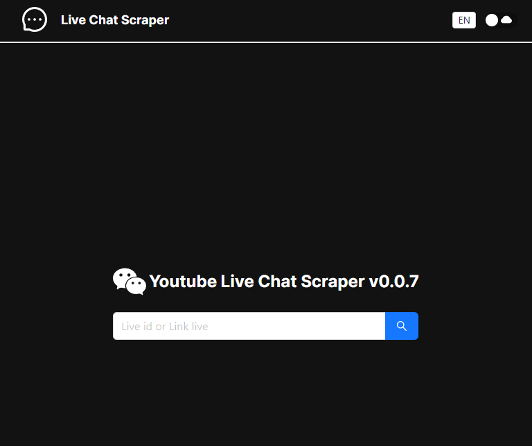
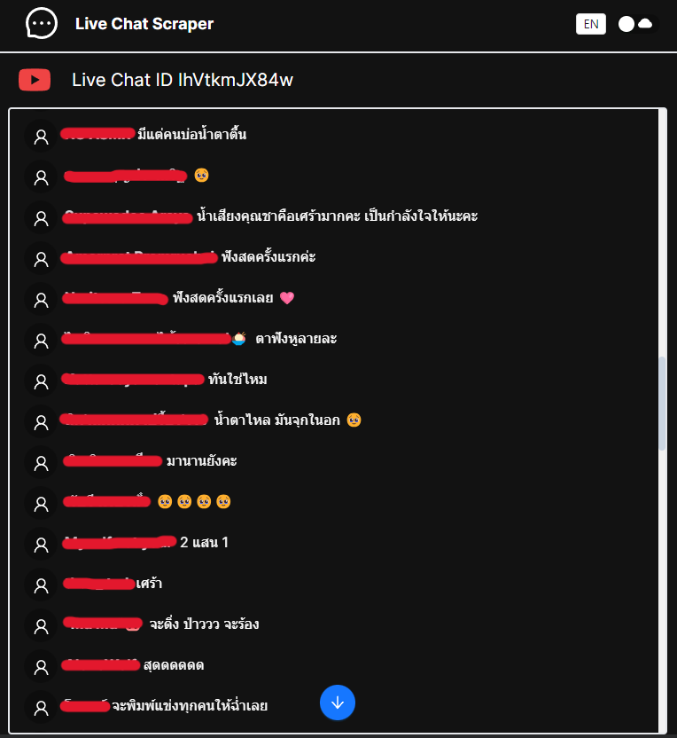

This is a [Next.js](https://nextjs.org/) project Live Chat Scraper

### Getting Started

First, run the development server:

```bash

npm i

npm run dev

```

Open [http://localhost:3000](http://localhost:3000) with your browser to see the result.

### Screenshots

<p align="center">
  
</p>
<p align="center">
  
</p>